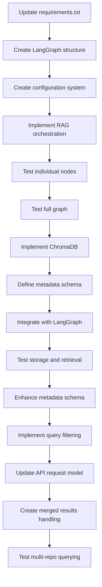

# DeepWiki Refactoring & Integration Tasks

This document tracks the progress and requirements for refactoring DeepWiki to use the new LangGraph-based RAG backend, and for fully integrating it with a modern, modular frontend.

---

## Phase 1: Backend Refactoring & Core Features

### Step 1.1: LangGraph RAG Pipeline Foundation
- [x] Create `api/langgraph_rag.py` with modular node-based pipeline
- [x] Implement document loading (Git repo & local directory)
    - [x] CLI test for document loading
- [x] Implement text splitting with configurable chunking
    - [x] CLI test for text splitting
- [x] Implement embedding node (OpenAI)
    - [x] CLI test for embedding node
- [x] Implement vector storage node (ChromaDB)
    - [x] CLI test for vector storage
- [x] Implement retrieval node
    - [x] CLI test for retrieval
- [x] Implement answer generation node (Gemini/OpenAI)
    - [x] CLI test for full pipeline

---

## Phase 2: Incremental Frontend + Backend Feature Development

For each major feature, implement both the backend API and the frontend UI in tandem. Test end-to-end before moving to the next feature. This ensures rapid feedback and modular, testable progress.

### Step 2.1: Project/Repo Selection
- [ ] Backend: API endpoint to list/select available repositories
- [ ] Frontend: UI for selecting a repository (Next.js, shadcn/ui, Tailwind)
- [ ] Test: End-to-end selection and state propagation

### Step 2.2: Add New Repository & Wiki Generation
- [ ] Backend: API to add a new repository (by URL or path)
- [ ] Frontend: UI to add a new repository (form/input)
- [ ] Backend: Trigger wiki structure generation for new repo
- [ ] Frontend: Show progress indicator for scanning/indexing
- [ ] Backend: API to report scanning/indexing progress
- [ ] Test: End-to-end flow for adding, generating wiki, and progress feedback

### Step 2.3: Wiki Structure Overview
- [x] Backend: API to return wiki structure (sections, hierarchy)
- [x] Frontend: UI to display wiki structure (sidebar/tree view)
- [x] Test: Structure loads and displays correctly

### Step 2.3.1: RAG Pipeline & Specialized Prompts (PRIORITY)
- [x] Backend: Implement RAG pipeline with embedding persistence and retrieval (triggered after repo copy/clone)
- [x] Backend: Implement specialized prompt/context logic for each wiki section type using RAG-retrieved context

### Step 2.4: Section Rendering (Content Pages)
- [x] Backend: API to return section content (with prompts for consistency)
- [x] Frontend: UI to render section content (markdown/code/mermaid)
- [x] Test: Section loads and renders as expected
- [x] Backend: LLM-powered wiki page content generation (Markdown with front matter and mermaid support)

### Step 2.5: Technical Summary Section
- [ ] Backend: API to generate technical summary (languages, AWS, DBs, etc.)
- [ ] Frontend: UI to display technical summary
- [ ] Test: Summary is accurate and well-presented

### Step 2.6: Mermaid Diagrams
- [ ] Backend: API to generate mermaid diagrams for relevant sections
- [ ] Frontend: UI to render mermaid diagrams (live preview)
- [ ] Test: Diagrams render and update correctly

### Step 2.7: Search & Navigation
- [ ] Backend: API for full-text search across wiki
- [ ] Frontend: UI for search and navigation
- [ ] Test: Search results are relevant and navigation is smooth

---

## Phase 3: Integration, Testing, and Polish
- [ ] End-to-end integration tests for all features
- [ ] Accessibility and UX review
- [ ] Performance optimization (backend and frontend)
- [ ] Documentation and usage examples

---

## Phase 4: UI Refactor & AWS-Ready Deployment
- [ ] Modularize UI components (Next.js app directory, shadcn/ui, Tailwind)
- [ ] Ensure clean black and white theme
- [ ] Prepare for easy AWS deployment (Vercel/Amplify/EC2)
- [ ] Provide deployment scripts and instructions

### Proposed UI Structure (Next.js)
```
/src
  /app
    /[repo]         # Dynamic repo pages
      /[section]    # Dynamic section pages
    /api            # API routes (Next.js)
  /components       # Modular UI components (sidebar, section, summary, diagram, etc.)
  /lib              # Shared utilities
  /styles           # Tailwind config, global styles
```
- Use shadcn/ui for all UI primitives
- Use Tailwind for layout and theming
- Keep all features modular and testable

---

## Notes
- Ollama support is deferred (nice to have)
- Prompts for wiki structure and sections must be reviewed for consistency and quality
- Each section prompt should specify requirements and mermaid diagram expectations
- Every wiki must include a technical summary section (languages, AWS, DBs, etc.)

## Dependency Graph



## Next Steps After Phase 1

Once Phase 1 is complete, we'll proceed to:
- Phase 2: Frontend & API Adjustments for Local Paths
- Phase 3: Testing and Refinement 

## Future Enhancements
- [x] Polish markdown and mermaid diagram styling for improved readability and UX (2024-08-05)
- [ ] Add support for more markdown features (tables, images, task lists, images, etc.)
- [ ] Implement full-text search across wiki content
- [ ] Implement technical summary section with extracted repo stats and technologies
- [ ] Add advanced features (e.g., export, multi-repo, user settings, etc.)
- [ ] Further optimize performance and accessibility 

## Discovered During Work
- [ ] Add ability to delete a repository (remove from wiki-data/repos and all related data)
- [ ] Add ability to refresh (re-clone/re-copy) a repository and re-run the pipeline 
- [x] Move wiki structure/content generation functions to api/langgraph/wiki_structure.py and delete api/langgraph_rag.py (2024-07-26)
- [x] Fix YAML frontmatter handling to properly extract metadata and render clean content (2024-07-29)
- [x] Standardize wiki page generation to use consistent frontmatter format (2024-07-29)
- [x] Add regenerate-wiki endpoint to update existing wikis with standardized frontmatter (2024-07-29)
- [x] Improve progress status handling by validating against actual content (2024-07-29)
- [x] Add reset-wiki-status endpoint to fix incorrect status states (2024-07-29)
- [x] Implement LLM-powered auto-fix for Mermaid diagram errors with a maximum of two attempts (2024-08-03)
- [x] Fix chat functionality to use ollama_nomic embeddings instead of OpenAI embeddings (2024-05-12)
- [x] Create test_wiki_embeddings.py to verify consistent use of ollama_nomic embeddings for wiki generation (2024-05-12)
- [x] Add special handling for directory structure rendering with fixed-width font and proper formatting (2024-08-05)
- **[2023-05-04]** Improved directory structure rendering in frontend
- **[2023-05-10]** Fixed collection name issue with customs_exchange_rate_main repository
- [x] Fixed collection name issue with customs_exchange_rate_main repository (2024-05-10):
  - Added collection_name parameter to API for direct ChromaDB collection access
  - Updated frontend chat API route to support explicit collection names
  - Created `check_collections.py` utility to find correct collection names
  - Added URL parameter support via `/?repo=name&collection=collection_name`
  - Updated ChatPanel component to use collection name when provided
  - Added comprehensive documentation in CHAT_API_GUIDE.md
  - [x] Fixed Document serialization issue causing 500 Internal Server Error (2024-08-08)
  - [x] Improved collection name resolution (2024-08-08):
    - Moved collection name resolution logic from frontend to backend
    - Implemented automatic variation matching in get_chat_response
    - Removed hardcoded collection mappings from frontend
    - Made collection lookup seamless and transparent to clients
  - [x] Fixed field name mismatch in RAG pipeline (2024-08-08):
    - Updated generate_node to look for "retrieved_documents" instead of "relevant_documents"
    - Ensured consistent naming across the RAG pipeline
    - Fixed docstring in generate.py to reflect the correct field name
- [x] Fix broken test_chat_customs.py and test_chat_api_endpoint.py to work with the new documentation database (2024-05-10)

## Tasks

### Completed
- [x] Create test_wiki_embeddings.py to verify consistent use of ollama_nomic embeddings for wiki generation (2024-05-12)
- [x] Add special handling for directory structure rendering with fixed-width font and proper formatting (2024-08-05)
- [x] Enhanced Mermaid diagram auto-fix functionality with improved error recovery (2024-05-20)
- [x] Fixed collection name issue with customs_exchange_rate_main repository (2024-05-10):
  - Added collection_name parameter to API for direct ChromaDB collection access
  - Updated frontend chat API route to support explicit collection names
  - Created `check_collections.py` utility to find correct collection names
  - Added URL parameter support via `/?repo=name&collection=collection_name`
  - Updated ChatPanel component to use collection name when provided
  - Added comprehensive documentation in CHAT_API_GUIDE.md
  - [x] Fixed Document serialization issue causing 500 Internal Server Error (2024-08-08)
  - [x] Improved collection name resolution (2024-08-08):
    - Moved collection name resolution logic from frontend to backend
    - Implemented automatic variation matching in get_chat_response
    - Removed hardcoded collection mappings from frontend
    - Made collection lookup seamless and transparent to clients
  - [x] Fixed field name mismatch in RAG pipeline (2024-08-08):
    - Updated generate_node to look for "retrieved_documents" instead of "relevant_documents"
    - Ensured consistent naming across the RAG pipeline
    - Fixed docstring in generate.py to reflect the correct field name
- [x] Fix broken test_chat_customs.py and test_chat_api_endpoint.py to work with the new documentation database (2024-05-10)

### In Progress
- [ ] Refactor API endpoints to use standardized error handling

### TODO
- [ ] Improve embeddings service reliability by adding retry logic around ollama calls
- [ ] Add support for code execution in notebook-style UI
- [ ] Create user documentation for markdown+chat features

### Discovered During Work
- The hash generation for collection names depends on the absolute path of the repository on disk, which can cause mismatches when accessing collections by repository ID alone.
- Solution: Use the collection_name parameter explicitly with the exact name of the collection in ChromaDB or add a hardcoded mapping in the frontend API. 